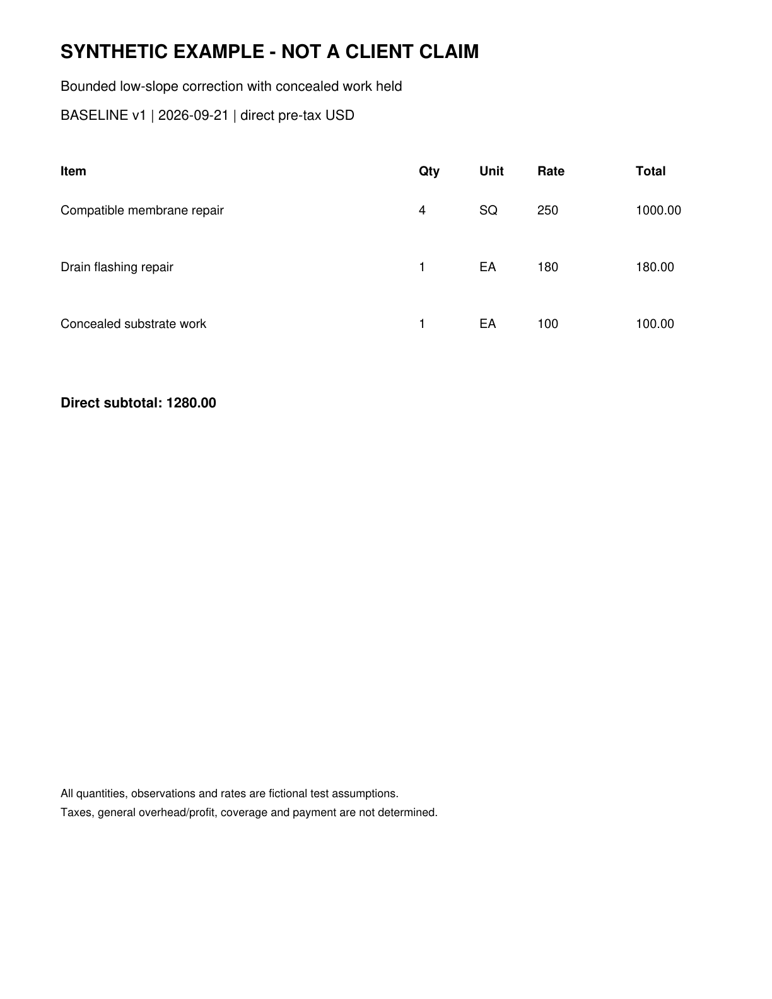
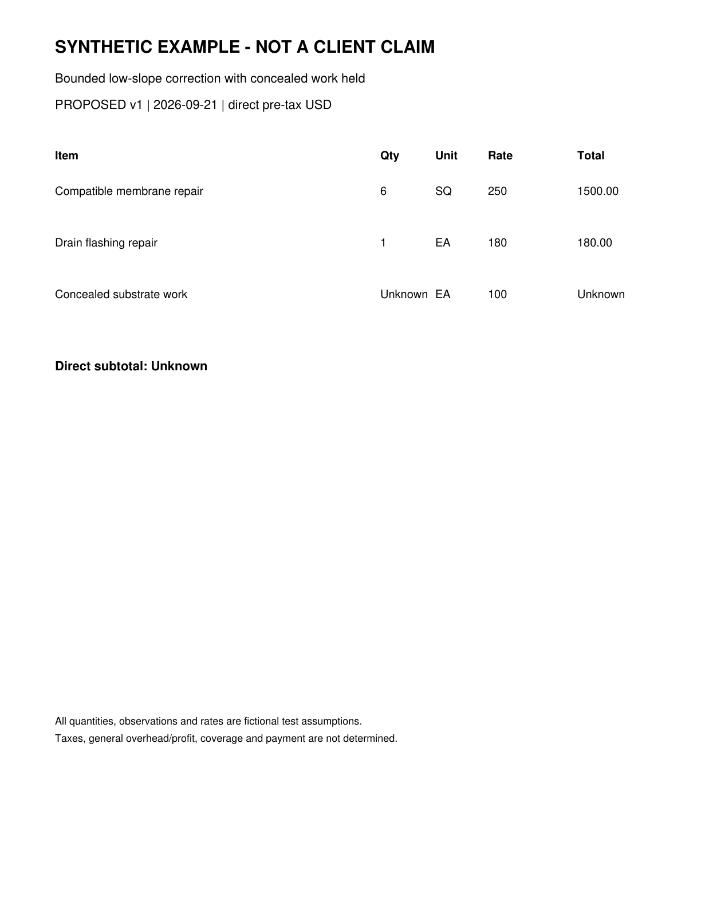

# Roof Estimate Evidence Appendix

SYNTHETIC EXAMPLE - NOT FOR SUBMISSION

Exhibits support the specified observations only. Original bytes and complete hashes are preserved in the case and run manifests.

| Exhibit | Document and page | What it shows |
| --- | --- | --- |
| E-BASE | D-4b7a6e9057262960-baseline p. 1 | Synthetic baseline estimate |
| E-PROP | D-ba2174ea0c6eca22-proposed p. 1 | Synthetic proposed estimate |
| E-NOTES | D-cfe89c3bb604fd9b-evidence p. 1 | Fictional scenario premises and limitations |

## Original document index

| Document | Version | SHA256 prefix |
| --- | --- | --- |
| D-4b7a6e9057262960-baseline | v1 | 4b7a6e9057262960 |
| D-ba2174ea0c6eca22-proposed | v1 | ba2174ea0c6eca22 |
| D-cfe89c3bb604fd9b-evidence | v1 | cfe89c3bb604fd9b |

## Numerical source trace

line:B1:quantity: 4; raw 4; D-4b7a6e9057262960-baseline p. 1; crop [88, 314, 1140, 354]; unit SQ.

line:B1:unit_price: 250; raw 250; D-4b7a6e9057262960-baseline p. 1; crop [88, 314, 1140, 354]; unit USD/SQ.

line:B1:reported_total: 1000.00; raw 1000.00; D-4b7a6e9057262960-baseline p. 1; crop [88, 314, 1140, 354]; unit USD.

line:P1:quantity: 6; raw 6; D-ba2174ea0c6eca22-proposed p. 1; crop [88, 314, 1140, 354]; unit SQ.

line:P1:unit_price: 250; raw 250; D-ba2174ea0c6eca22-proposed p. 1; crop [88, 314, 1140, 354]; unit USD/SQ.

line:P1:reported_total: 1500.00; raw 1500.00; D-ba2174ea0c6eca22-proposed p. 1; crop [88, 314, 1140, 354]; unit USD.

line:B2:quantity: 1; raw 1; D-4b7a6e9057262960-baseline p. 1; crop [88, 404, 1140, 444]; unit EA.

line:B2:unit_price: 180; raw 180; D-4b7a6e9057262960-baseline p. 1; crop [88, 404, 1140, 444]; unit USD/EA.

line:B2:reported_total: 180.00; raw 180.00; D-4b7a6e9057262960-baseline p. 1; crop [88, 404, 1140, 444]; unit USD.

line:P2:quantity: 1; raw 1; D-ba2174ea0c6eca22-proposed p. 1; crop [88, 404, 1140, 444]; unit EA.

line:P2:unit_price: 180; raw 180; D-ba2174ea0c6eca22-proposed p. 1; crop [88, 404, 1140, 444]; unit USD/EA.

line:P2:reported_total: 180.00; raw 180.00; D-ba2174ea0c6eca22-proposed p. 1; crop [88, 404, 1140, 444]; unit USD.

line:B3:quantity: 1; raw 1; D-4b7a6e9057262960-baseline p. 1; crop [88, 494, 1140, 534]; unit EA.

line:B3:unit_price: 100; raw 100; D-4b7a6e9057262960-baseline p. 1; crop [88, 494, 1140, 534]; unit USD/EA.

line:B3:reported_total: 100.00; raw 100.00; D-4b7a6e9057262960-baseline p. 1; crop [88, 494, 1140, 534]; unit USD.

line:P3:quantity: Unknown; raw Unknown; D-ba2174ea0c6eca22-proposed p. 1; crop [88, 494, 1140, 534]; unit EA.

line:P3:unit_price: 100; raw 100; D-ba2174ea0c6eca22-proposed p. 1; crop [88, 494, 1140, 534]; unit USD/EA.

line:P3:reported_total: Unknown; raw Unknown; D-ba2174ea0c6eca22-proposed p. 1; crop [88, 494, 1140, 534]; unit USD.

document:D-4b7a6e9057262960-baseline:reported_direct_total: 1280.00; raw 1280.00; D-4b7a6e9057262960-baseline p. 1; crop [88, 618, 1140, 662]; unit USD.

document:D-ba2174ea0c6eca22-proposed:reported_direct_total: Unknown; raw Unknown; D-ba2174ea0c6eca22-proposed p. 1; crop [88, 618, 1140, 662]; unit USD.

## Evidence excerpts

E-BASE | D-4b7a6e9057262960-baseline page 1 | Synthetic baseline estimate

E-PROP | D-ba2174ea0c6eca22-proposed page 1 | Synthetic proposed estimate

## Context packs considered

Context packs guide questions and writing. Their prices and rules are not automatically applied to this claim.

arizona-roofing-research 2026.09.21: Arizona roofing research context as of September 21 2026
