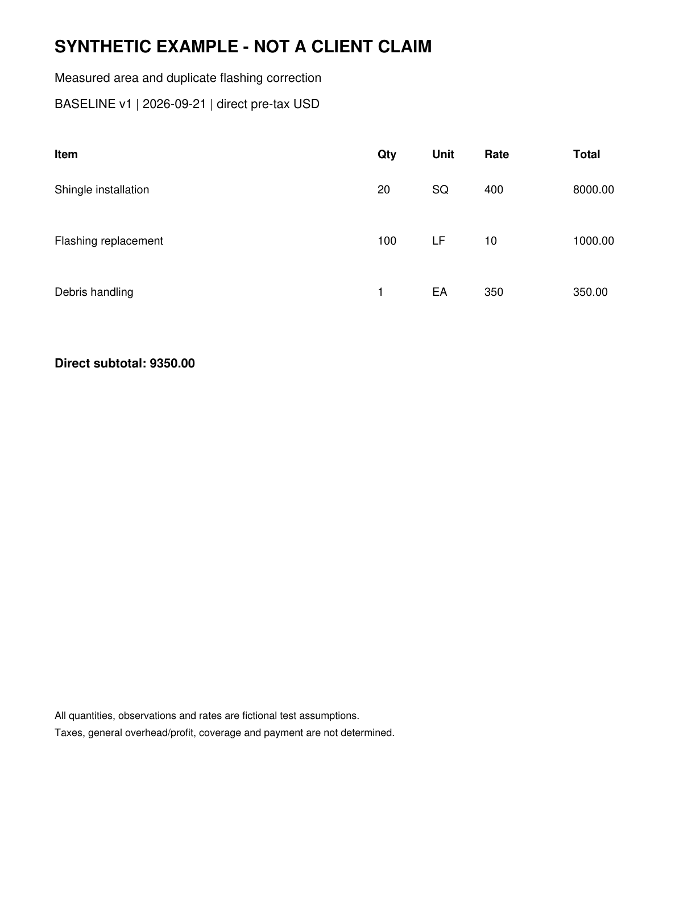
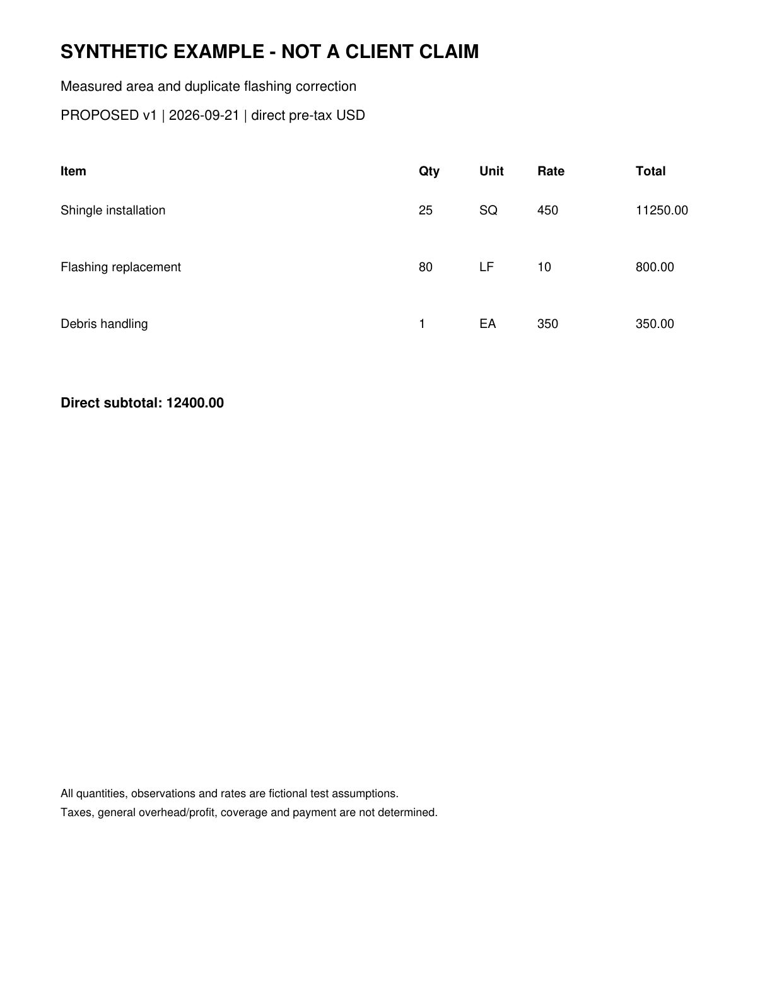

# Roof Estimate Evidence Appendix

SYNTHETIC EXAMPLE - NOT FOR SUBMISSION

Exhibits support the specified observations only. Original bytes and complete hashes are preserved in the case and run manifests.

| Exhibit | Document and page | What it shows |
| --- | --- | --- |
| E-BASE | D-0a8cdb16803b6342-baseline p. 1 | Synthetic baseline estimate |
| E-PROP | D-0369cd31be69d411-proposed p. 1 | Synthetic proposed estimate |
| E-NOTES | D-7430ff3e312257b9-evidence p. 1 | Fictional scenario premises and limitations |

## Original document index

| Document | Version | SHA256 prefix |
| --- | --- | --- |
| D-0a8cdb16803b6342-baseline | v1 | 0a8cdb16803b6342 |
| D-0369cd31be69d411-proposed | v1 | 0369cd31be69d411 |
| D-7430ff3e312257b9-evidence | v1 | 7430ff3e312257b9 |

## Numerical source trace

line:B1:quantity: 20; raw 20; D-0a8cdb16803b6342-baseline p. 1; crop [88, 314, 1140, 354]; unit SQ.

line:B1:unit_price: 400; raw 400; D-0a8cdb16803b6342-baseline p. 1; crop [88, 314, 1140, 354]; unit USD/SQ.

line:B1:reported_total: 8000.00; raw 8000.00; D-0a8cdb16803b6342-baseline p. 1; crop [88, 314, 1140, 354]; unit USD.

line:P1:quantity: 25; raw 25; D-0369cd31be69d411-proposed p. 1; crop [88, 314, 1140, 354]; unit SQ.

line:P1:unit_price: 450; raw 450; D-0369cd31be69d411-proposed p. 1; crop [88, 314, 1140, 354]; unit USD/SQ.

line:P1:reported_total: 11250.00; raw 11250.00; D-0369cd31be69d411-proposed p. 1; crop [88, 314, 1140, 354]; unit USD.

line:B2:quantity: 100; raw 100; D-0a8cdb16803b6342-baseline p. 1; crop [88, 404, 1140, 444]; unit LF.

line:B2:unit_price: 10; raw 10; D-0a8cdb16803b6342-baseline p. 1; crop [88, 404, 1140, 444]; unit USD/LF.

line:B2:reported_total: 1000.00; raw 1000.00; D-0a8cdb16803b6342-baseline p. 1; crop [88, 404, 1140, 444]; unit USD.

line:P2:quantity: 80; raw 80; D-0369cd31be69d411-proposed p. 1; crop [88, 404, 1140, 444]; unit LF.

line:P2:unit_price: 10; raw 10; D-0369cd31be69d411-proposed p. 1; crop [88, 404, 1140, 444]; unit USD/LF.

line:P2:reported_total: 800.00; raw 800.00; D-0369cd31be69d411-proposed p. 1; crop [88, 404, 1140, 444]; unit USD.

line:B3:quantity: 1; raw 1; D-0a8cdb16803b6342-baseline p. 1; crop [88, 494, 1140, 534]; unit EA.

line:B3:unit_price: 350; raw 350; D-0a8cdb16803b6342-baseline p. 1; crop [88, 494, 1140, 534]; unit USD/EA.

line:B3:reported_total: 350.00; raw 350.00; D-0a8cdb16803b6342-baseline p. 1; crop [88, 494, 1140, 534]; unit USD.

line:P3:quantity: 1; raw 1; D-0369cd31be69d411-proposed p. 1; crop [88, 494, 1140, 534]; unit EA.

line:P3:unit_price: 350; raw 350; D-0369cd31be69d411-proposed p. 1; crop [88, 494, 1140, 534]; unit USD/EA.

line:P3:reported_total: 350.00; raw 350.00; D-0369cd31be69d411-proposed p. 1; crop [88, 494, 1140, 534]; unit USD.

document:D-0a8cdb16803b6342-baseline:reported_direct_total: 9350.00; raw 9350.00; D-0a8cdb16803b6342-baseline p. 1; crop [88, 618, 1140, 662]; unit USD.

document:D-0369cd31be69d411-proposed:reported_direct_total: 12400.00; raw 12400.00; D-0369cd31be69d411-proposed p. 1; crop [88, 618, 1140, 662]; unit USD.

## Evidence excerpts

E-BASE | D-0a8cdb16803b6342-baseline page 1 | Synthetic baseline estimate

E-PROP | D-0369cd31be69d411-proposed page 1 | Synthetic proposed estimate

## Context packs considered

Context packs guide questions and writing. Their prices and rules are not automatically applied to this claim.

arizona-roofing-research 2026.09.21: Arizona roofing research context as of September 21 2026
