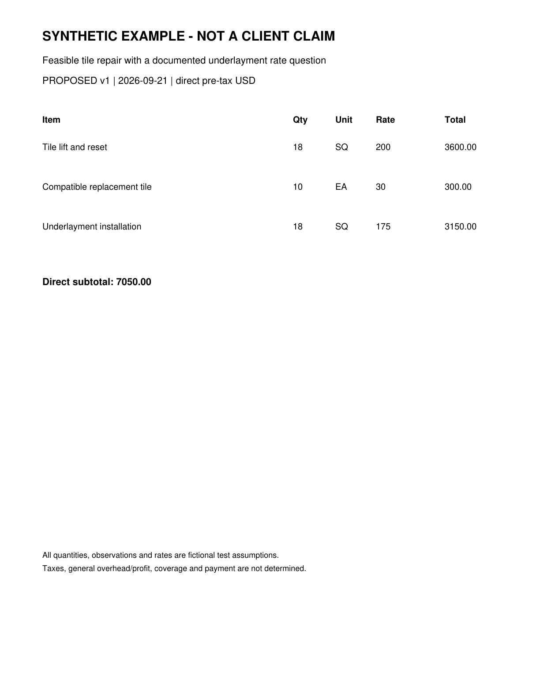

# Roof Estimate Evidence Appendix

SYNTHETIC EXAMPLE - NOT FOR SUBMISSION

Exhibits support the specified observations only. Original bytes and complete hashes are preserved in the case and run manifests.

| Exhibit | Document and page | What it shows |
| --- | --- | --- |
| E-BASE | D-520dd659127de253-baseline p. 1 | Synthetic baseline estimate |
| E-PROP | D-4be3da93eee26df5-proposed p. 1 | Synthetic proposed estimate |
| E-NOTES | D-5f56f76c6579984c-evidence p. 1 | Fictional scenario premises and limitations |

## Original document index

| Document | Version | SHA256 prefix |
| --- | --- | --- |
| D-520dd659127de253-baseline | v1 | 520dd659127de253 |
| D-4be3da93eee26df5-proposed | v1 | 4be3da93eee26df5 |
| D-5f56f76c6579984c-evidence | v1 | 5f56f76c6579984c |

## Numerical source trace

line:B1:quantity: 18; raw 18; D-520dd659127de253-baseline p. 1; crop [88, 314, 1140, 354]; unit SQ.

line:B1:unit_price: 200; raw 200; D-520dd659127de253-baseline p. 1; crop [88, 314, 1140, 354]; unit USD/SQ.

line:B1:reported_total: 3600.00; raw 3600.00; D-520dd659127de253-baseline p. 1; crop [88, 314, 1140, 354]; unit USD.

line:P1:quantity: 18; raw 18; D-4be3da93eee26df5-proposed p. 1; crop [88, 314, 1140, 354]; unit SQ.

line:P1:unit_price: 200; raw 200; D-4be3da93eee26df5-proposed p. 1; crop [88, 314, 1140, 354]; unit USD/SQ.

line:P1:reported_total: 3600.00; raw 3600.00; D-4be3da93eee26df5-proposed p. 1; crop [88, 314, 1140, 354]; unit USD.

line:B2:quantity: 10; raw 10; D-520dd659127de253-baseline p. 1; crop [88, 404, 1140, 444]; unit EA.

line:B2:unit_price: 30; raw 30; D-520dd659127de253-baseline p. 1; crop [88, 404, 1140, 444]; unit USD/EA.

line:B2:reported_total: 300.00; raw 300.00; D-520dd659127de253-baseline p. 1; crop [88, 404, 1140, 444]; unit USD.

line:P2:quantity: 10; raw 10; D-4be3da93eee26df5-proposed p. 1; crop [88, 404, 1140, 444]; unit EA.

line:P2:unit_price: 30; raw 30; D-4be3da93eee26df5-proposed p. 1; crop [88, 404, 1140, 444]; unit USD/EA.

line:P2:reported_total: 300.00; raw 300.00; D-4be3da93eee26df5-proposed p. 1; crop [88, 404, 1140, 444]; unit USD.

line:B3:quantity: 18; raw 18; D-520dd659127de253-baseline p. 1; crop [88, 494, 1140, 534]; unit SQ.

line:B3:unit_price: 150; raw 150; D-520dd659127de253-baseline p. 1; crop [88, 494, 1140, 534]; unit USD/SQ.

line:B3:reported_total: 2700.00; raw 2700.00; D-520dd659127de253-baseline p. 1; crop [88, 494, 1140, 534]; unit USD.

line:P3:quantity: 18; raw 18; D-4be3da93eee26df5-proposed p. 1; crop [88, 494, 1140, 534]; unit SQ.

line:P3:unit_price: 175; raw 175; D-4be3da93eee26df5-proposed p. 1; crop [88, 494, 1140, 534]; unit USD/SQ.

line:P3:reported_total: 3150.00; raw 3150.00; D-4be3da93eee26df5-proposed p. 1; crop [88, 494, 1140, 534]; unit USD.

document:D-520dd659127de253-baseline:reported_direct_total: 6600.00; raw 6600.00; D-520dd659127de253-baseline p. 1; crop [88, 618, 1140, 662]; unit USD.

document:D-4be3da93eee26df5-proposed:reported_direct_total: 7050.00; raw 7050.00; D-4be3da93eee26df5-proposed p. 1; crop [88, 618, 1140, 662]; unit USD.

## Evidence excerpts

E-BASE | D-520dd659127de253-baseline page 1 | Synthetic baseline estimate

E-PROP | D-4be3da93eee26df5-proposed page 1 | Synthetic proposed estimate

## Context packs considered

Context packs guide questions and writing. Their prices and rules are not automatically applied to this claim.

arizona-roofing-research 2026.09.21: Arizona roofing research context as of September 21 2026
